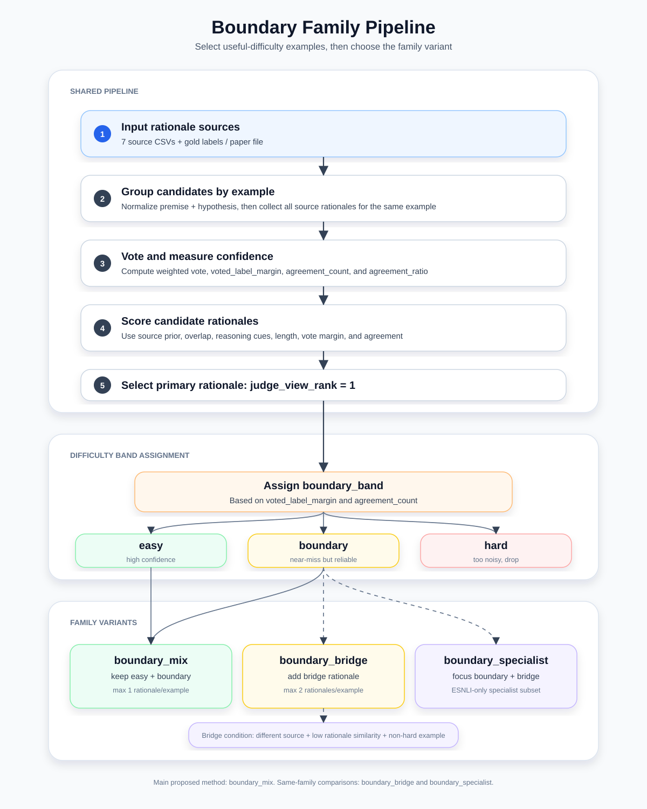

# Boundary Family Pipeline

Tài liệu này tập trung riêng vào family của:

```text
judge_student_boundary_mix_balanced
```

Family này gồm:

```text
judge_student_boundary_mix_balanced
judge_student_boundary_bridge_balanced
judge_student_boundary_specialist_balanced
```

Mục tiêu khi viết trong thesis:

- chọn `judge_student_boundary_mix_balanced` làm method chính
- giải thích pipeline boundary-based rationale selection
- so sánh với các biến thể cùng family
- cho thấy vì sao `boundary_mix` ổn định nhất trên cả ESNLI và CQA

---

## Pipeline diagram



Hình trên mô tả pipeline chung của boundary family:

- gom rationale từ 7 source
- vote label/answer
- tính agreement và margin
- chấm điểm rationale
- gán `boundary_band`
- rẽ nhánh thành `boundary_mix`, `boundary_bridge`, hoặc `boundary_specialist`

---

## 1. Ý tưởng chính của boundary family

Boundary family không chỉ hỏi:

```text
Rationale nào tốt nhất?
```

Mà nó hỏi thêm:

```text
Example này có đáng để train không?
```

Mỗi example được chia thành một trong các vùng:

```text
easy
boundary
hard
bridge
```

Ý nghĩa:

| Band | Ý nghĩa |
|---|---|
| `easy` | Nhiều source đồng ý, vote margin cao, example khá chắc |
| `boundary` | Gần vùng dễ nhầm, nhưng vẫn có đủ tín hiệu để học |
| `hard` | Source chia phiếu mạnh, margin thấp, dễ nhiễu |
| `bridge` | Rationale phụ tốt, khác source, dùng để bổ sung cách hiểu |

Method chính `judge_student_boundary_mix_balanced` chỉ giữ:

```text
easy + boundary
```

và bỏ:

```text
hard
```

Điểm quan trọng:

```text
hard là độ khó của example, không phải độ khó của riêng một rationale.
```

---

## 2. Vì sao chọn `judge_student_boundary_mix_balanced`?

Dựa vào bảng performance bạn cung cấp:

| Type | ESNLI | CQA |
|---|---:|---:|
| baseline | 83.93 | 60.36 |
| `judge_student_boundary_mix_balanced` | 84.16 | 62.41 |
| `judge_student_boundary_bridge_balanced` | 85.06 | 60.52 |

Nhận xét:

- `boundary_bridge` cao nhất trên ESNLI: `85.06`
- `boundary_mix` cao nhất trên CQA: `62.41`
- `boundary_mix` cải thiện cả ESNLI và CQA so với baseline
- `boundary_bridge` tăng ESNLI mạnh, nhưng CQA chỉ tăng nhẹ so với baseline

Vì thesis cần method ổn định trên cả hai dataset, chọn:

```text
judge_student_boundary_mix_balanced
```

Câu viết ngắn trong thesis:

> We select `judge_student_boundary_mix_balanced` as the proposed method because it improves over the baseline on both ESNLI and CQA, and achieves the strongest CQA performance among the compared methods. This indicates that filtering examples by useful difficulty is more stable across datasets than adding extra bridge rationales.

---

## 3. Input của boundary family

### 3.1. ESNLI

Gold source:

```text
[API] ESNLI/paper - full.csv
```

hoặc local JSON nếu có:

```text
datasets/esnli/esnli_train.json
datasets/esnli/esnli_valid.json
datasets/esnli/esnli_test.json
```

7 source rationale:

```text
[API] ESNLI/neutral - full.csv
[API] ESNLI/contrastive - full.csv
[API] ESNLI/historical - full.csv
[API] ESNLI/comparative - full.csv
[API] ESNLI/causal - full.csv
[API] ESNLI/consensus - full.csv
[API] ESNLI/if_else - full.csv
```

### 3.2. CQA

Gold source:

```text
[API] CQA/paper.csv
```

7 source rationale:

```text
[API] CQA/historical - full.csv
[API] CQA/consensus - full.csv
[API] CQA/contrastive - full.csv
[API] CQA/causal - full.csv
[API] CQA/neutral - full.csv
[API] CQA/if_else - full.csv
[API] CQA/comparative - full.csv
```

Mỗi source file cần các cột:

```text
premise
hypothesis
rationale
LLM_answer
```

---

## 4. Pipeline tổng quát

Pipeline boundary family có thể chia thành 9 bước.

Trước khi đi vào từng bước, phần dưới giải thích thật kỹ 3 khái niệm dễ gây nhầm:

1. `normalize` và cách group candidates
2. `weighted vote` và vì sao dùng `voted_label_margin`
3. `judge_score`: source đáng tin, overlap với premise/hypothesis, cue giải thích, agreement

---

## 4.1. `normalize` là gì và group candidates như thế nào?

### 4.1.1. Vấn đề cần giải quyết

Ta có 7 source khác nhau.

Mỗi source có một file CSV riêng.

Ví dụ:

```text
[API] ESNLI/neutral - full.csv
[API] ESNLI/contrastive - full.csv
[API] ESNLI/historical - full.csv
...
```

Mỗi file có nhiều dòng.

Một dòng thường có:

```text
premise
hypothesis
rationale
LLM_answer
```

Bây giờ ta cần biết:

```text
Dòng nào trong neutral, contrastive, causal... đang nói về cùng một example?
```

Nếu không group đúng, ta không thể vote, không thể tính agreement, và không thể biết source nào đồng ý với source nào.

---

### 4.1.2. `normalize` nghĩa là dọn text cho giống nhau hơn

Trong code, normalize text làm việc đơn giản:

```python
def normalize_text(text):
    if pd.isna(text):
        return ""
    return re.sub(r"\s+", " ", str(text)).strip()
```

Nói dễ hiểu:

- nếu text rỗng thì biến thành `""`
- nếu có nhiều dấu cách liên tiếp thì gom thành một dấu cách
- nếu có xuống dòng thì biến thành khoảng trắng
- xóa khoảng trắng ở đầu và cuối câu

Ví dụ:

```text
"  A man   is playing guitar.\n"
```

sau normalize thành:

```text
"A man is playing guitar."
```

Sau đó khi tạo key, builder còn dùng `.lower()`.

Ví dụ:

```text
"A Man Is Playing Guitar."
```

thành:

```text
"a man is playing guitar."
```

---

### 4.1.3. Example key là gì?

Builder tạo key như sau:

```text
normalize(premise).lower() + "</s>" + normalize(hypothesis).lower()
```

Ví dụ ESNLI:

```text
premise:
A man is playing guitar on stage.

hypothesis:
A person is performing music.
```

Key sẽ là:

```text
a man is playing guitar on stage.</s>a person is performing music.
```

Tất cả source nào có cùng key này sẽ được gom vào cùng một group.

---

### 4.1.4. Group candidates bằng key

Hãy tưởng tượng ta có 7 người cùng giải một bài.

Mỗi người viết lời giải vào một tờ giấy.

Ta cần bỏ 7 tờ giấy của cùng một bài vào cùng một folder.

Trong code, folder đó chính là:

```text
example_key
```

Ví dụ:

```text
example_key = "a man is playing guitar on stage.</s>a person is performing music."
```

Group sẽ chứa:

| source | LLM_answer | rationale |
|---|---|---|
| historical | entailment | A man playing guitar is performing music. |
| consensus | entailment | The hypothesis follows from the premise. |
| contrastive | entailment | It is not neutral because music is directly implied. |
| causal | entailment | Playing guitar causes the person to be performing music. |
| neutral | neutral | The premise does not say what song he plays. |
| if_else | entailment | If someone plays guitar on stage, then they perform music. |
| comparative | entailment | Performing music is more general than playing guitar. |

Sau khi group xong, builder mới có thể hỏi:

```text
7 source này đang vote label nào?
Rationale nào tốt nhất?
Example này easy, boundary hay hard?
```

---

### 4.1.5. Lỗi thường gặp khi group

Nếu cùng một example nhưng text bị lệch, group sẽ sai.

Ví dụ file A:

```text
A man is playing guitar on stage.
```

file B:

```text
A man plays guitar on the stage.
```

Hai câu này nghĩa gần giống nhau, nhưng text khác.

Key sẽ khác.

Builder sẽ tưởng đây là 2 example khác nhau.

Hậu quả:

- source không được gom chung
- `agreement_count` thấp
- `vote_margin` có thể thấp
- example dễ bị xem là hard hoặc bị bỏ

Vì vậy khi tạo source CSV, phải giữ `premise` và `hypothesis` nhất quán giữa các source.

---

## 4.2. Weighted vote tính như thế nào?

### 4.2.1. Vote thường là gì?

Vote thường nghĩa là mỗi source có 1 phiếu như nhau.

Ví dụ:

```text
historical  -> entailment
causal      -> entailment
neutral     -> neutral
if_else     -> entailment
comparative -> contradiction
```

Nếu đếm thường:

```text
entailment: 3 phiếu
neutral: 1 phiếu
contradiction: 1 phiếu
```

`entailment` thắng.

---

### 4.2.2. Weighted vote khác gì?

Weighted vote nghĩa là:

```text
source mạnh hơn thì phiếu nặng hơn
source yếu hơn thì phiếu nhẹ hơn
```

Không phải source nào cũng đáng tin giống nhau cho mọi label.

Ví dụ trong ESNLI boundary:

```text
entailment:
  historical = 1.00
  consensus = 0.98
  contrastive = 0.95
  causal = 0.92

neutral:
  if_else = 1.00
  comparative = 0.99
  neutral = 0.96

contradiction:
  comparative = 1.00
  contrastive = 0.99
  causal = 0.97
```

Nghĩa là:

- với `entailment`, `historical` được tin nhiều
- với `neutral`, `if_else` và `comparative` được tin nhiều
- với `contradiction`, `comparative`, `contrastive`, `causal` được tin nhiều

---

### 4.2.3. Công thức weighted vote cho ESNLI boundary

Trong code:

```python
scores[label] += BOUNDARY_SOURCE_PRIOR[label].get(candidate["source"], 0.0)
```

Dịch ra ngôn ngữ dễ hiểu:

```text
Nếu source S vote label L,
thì điểm của label L tăng thêm prior của source S đối với label L.
```

Ví dụ:

| source | vote label | prior được cộng |
|---|---|---:|
| historical | entailment | 1.00 |
| consensus | entailment | 0.98 |
| causal | entailment | 0.92 |
| neutral | neutral | 0.96 |
| comparative | contradiction | 1.00 |

Tổng score:

```text
entailment = 1.00 + 0.98 + 0.92 = 2.90
neutral = 0.96
contradiction = 1.00
```

Label thắng:

```text
voted_label = entailment
```

---

### 4.2.4. Weighted vote cho CQA

CQA khác ESNLI vì answer là text, không chỉ có 3 label cố định.

Ví dụ answer có thể là:

```text
kitchen
market
school
```

Trong CQA, code dùng source prior chung:

```text
causal      = 1.00
if_else     = 0.99
neutral     = 0.98
contrastive = 0.975
historical  = 0.94
consensus   = 0.84
comparative = 0.80
```

Công thức:

```text
score[answer] += source_prior[source]
```

Ví dụ:

| source | answer | prior |
|---|---|---:|
| causal | kitchen | 1.00 |
| if_else | kitchen | 0.99 |
| neutral | kitchen | 0.98 |
| historical | market | 0.94 |
| comparative | school | 0.80 |

Tổng:

```text
kitchen = 1.00 + 0.99 + 0.98 = 2.97
market = 0.94
school = 0.80
```

Voted answer:

```text
voted_label = kitchen
```

---

## 4.3. Vì sao `voted_label_margin = winner_score - runner_up_score`?

### 4.3.1. Winner score một mình chưa đủ

Giả sử có 2 example.

Example A:

```text
entailment = 3.0
neutral = 2.9
contradiction = 0.1
```

Example B:

```text
entailment = 3.0
neutral = 0.8
contradiction = 0.4
```

Cả hai đều có winner score:

```text
entailment = 3.0
```

Nhưng độ chắc chắn không giống nhau.

Example A rất sát:

```text
3.0 vs 2.9
```

Source gần như đang cãi nhau.

Example B rõ hơn:

```text
3.0 vs 0.8
```

Label thắng bỏ xa label thứ hai.

---

### 4.3.2. Margin đo độ cách biệt giữa label thắng và label về nhì

Công thức:

```text
voted_label_margin = winner_score - runner_up_score
```

Example A:

```text
3.0 - 2.9 = 0.1
```

Margin thấp.

Nghĩa là:

```text
Không chắc lắm, dễ nhầm.
```

Example B:

```text
3.0 - 0.8 = 2.2
```

Margin cao.

Nghĩa là:

```text
Label thắng khá chắc.
```

Nói kiểu trẻ em:

```text
Nếu người thắng chỉ hơn người thứ hai 1 điểm, cuộc thi rất sít sao.
Nếu người thắng hơn người thứ hai 50 điểm, người thắng rất rõ ràng.
```

Vì vậy margin giúp builder biết example đó là:

```text
easy, boundary, hay hard
```

---

## 4.4. Source đáng tin dựa theo gì?

### 4.4.0. Weight/prior này đến từ đâu?

Điểm rất quan trọng khi viết thesis:

```text
Các weight trong weighted vote không lấy trực tiếp từ original paper.
Các weight này cũng không được model tự học.
Chúng được định nghĩa thủ công trong builder code của project.
```

Nói chính xác hơn:

- với ESNLI, weight nằm trong `BOUNDARY_SOURCE_PRIOR`
- với CQA, weight nằm trong `BASE_SOURCE_PRIOR`
- các weight này đóng vai trò là `source reliability prior`
- nghĩa là: trước khi vote, ta giả định source nào đáng tin hơn source nào

Trong thesis, nên gọi chúng là:

```text
manually defined source reliability priors
```

hoặc:

```text
empirically motivated source priors
```

Không nên viết:

```text
These weights are from the original paper.
```

Vì điều đó không đúng.

Nên viết:

```text
The weighted vote uses manually defined source reliability priors. These priors are part of our judging pipeline and are empirically motivated by the observed behavior of different rationale sources.
```

Tuy nhiên, cách giải thích tốt hơn và dễ bảo vệ hơn là:

```text
Các prior này là ma trận độ phù hợp tương đối giữa kiểu rationale và label.
```

Nghĩa là:

```text
Mỗi source không chỉ là "mạnh" hay "yếu".
Mỗi source là một kiểu rationale.
Mỗi label cần một kiểu lập luận khác nhau.
```

Vì vậy prior trả lời câu hỏi:

```text
Kiểu rationale này phù hợp tự nhiên với label này đến mức nào?
```

Ví dụ:

- `comparative` và `contrastive` phù hợp với `contradiction` vì chúng giỏi chỉ ra sự khác biệt hoặc xung đột
- `if_else` phù hợp với `neutral` vì nó diễn đạt điều kiện còn thiếu
- `historical` và `consensus` phù hợp với `entailment` vì chúng thường tạo explanation ổn định, hỗ trợ quan hệ suy ra

Điều rất quan trọng:

```text
1.00, 0.98, 0.95 không phải xác suất chính xác.
```

Chúng chỉ là:

```text
soft relative weights
```

Tức là trọng số mềm thể hiện thứ tự ưu tiên tương đối.

Ví dụ:

```text
historical = 1.00
consensus = 0.98
```

không có nghĩa:

```text
historical chính xác 100%
consensus chính xác 98%
```

mà chỉ có nghĩa:

```text
historical được ưu tiên nhỉnh hơn consensus một chút cho label đó.
```

---

### 4.4.0.1. Weight của ESNLI nằm ở đâu?

Trong file:

```text
build_boundary_focus_pack.py
```

Biến:

```python
BOUNDARY_SOURCE_PRIOR
```

Ví dụ:

```python
BOUNDARY_SOURCE_PRIOR = {
    "entailment": {
        "historical": 1.00,
        "consensus": 0.98,
        "contrastive": 0.95,
        "causal": 0.92,
        "neutral": 0.88,
        "if_else": 0.74,
        "comparative": 0.70,
    },
    "neutral": {
        "if_else": 1.00,
        "comparative": 0.99,
        "neutral": 0.96,
        "contrastive": 0.90,
        "causal": 0.84,
        "consensus": 0.82,
        "historical": 0.72,
    },
    "contradiction": {
        "comparative": 1.00,
        "contrastive": 0.99,
        "causal": 0.97,
        "neutral": 0.89,
        "consensus": 0.84,
        "historical": 0.74,
        "if_else": 0.70,
    },
}
```

Điểm cần hiểu:

```text
ESNLI dùng weight theo từng label.
```

Tức là cùng một source có thể được tin khác nhau tùy label.

Ta có thể xem bảng này như một compatibility matrix:

| Label | historical | consensus | contrastive | causal | neutral | if_else | comparative |
|---|---:|---:|---:|---:|---:|---:|---:|
| `entailment` | 1.00 | 0.98 | 0.95 | 0.92 | 0.88 | 0.74 | 0.70 |
| `neutral` | 0.72 | 0.82 | 0.90 | 0.84 | 0.96 | 1.00 | 0.99 |
| `contradiction` | 0.74 | 0.84 | 0.99 | 0.97 | 0.89 | 0.70 | 1.00 |

Nói dễ hiểu:

```text
Mỗi source giống một học sinh có sở trường riêng.
Với dạng bài khác nhau, ta tin học sinh khác nhau nhiều hơn.
```

---

### 4.4.0.1.1. Vì sao `entailment` ưu tiên `historical`, `consensus`, `contrastive`, `causal`?

`entailment` nghĩa là:

```text
hypothesis được suy ra từ premise.
```

Nó cần rationale kiểu:

```text
Premise nói A.
Hypothesis là hệ quả hoặc cách nói tổng quát hơn của A.
Vì vậy hypothesis đúng.
```

Prior cho `entailment`:

| Source | Prior | Cách hiểu |
|---|---:|---|
| `historical` | 1.00 | ưu tiên cao nhất |
| `consensus` | 0.98 | gần như ngang `historical` |
| `contrastive` | 0.95 | vẫn rất phù hợp |
| `causal` | 0.92 | phù hợp nếu quan hệ có dạng nguyên nhân/hệ quả |
| `neutral` | 0.88 | dùng được nhưng không ưu tiên nhất |
| `if_else` | 0.74 | ít phù hợp hơn |
| `comparative` | 0.70 | thấp nhất trong entailment |

Ví dụ:

```text
Premise: A man is playing guitar on stage.
Hypothesis: A person is performing music.
Label: entailment
```

Rationale phù hợp:

```text
Playing guitar is a form of performing music, so the hypothesis follows.
```

Tại sao các source đầu được ưu tiên:

- `historical`: thường viết explanation ổn định, nối premise với hypothesis
- `consensus`: phù hợp khi quan hệ suy ra rõ ràng và nhiều nguồn đồng ý
- `contrastive`: có thể giải thích vì sao không phải neutral/contradiction
- `causal`: có thể giải thích quan hệ hành động dẫn đến kết luận

---

### 4.4.0.1.2. Vì sao `neutral` ưu tiên `if_else`, `comparative`, `neutral`?

`neutral` nghĩa là:

```text
hypothesis có thể đúng, nhưng premise không đủ thông tin để kết luận.
```

Nó cần rationale kiểu:

```text
Premise không nói rõ X.
Nếu X đúng thì hypothesis có thể đúng.
Nhưng hiện tại không đủ thông tin.
```

Prior cho `neutral`:

| Source | Prior | Cách hiểu |
|---|---:|---|
| `if_else` | 1.00 | ưu tiên cao nhất |
| `comparative` | 0.99 | gần như ngang `if_else` |
| `neutral` | 0.96 | rất phù hợp |
| `contrastive` | 0.90 | phù hợp vừa |
| `causal` | 0.84 | ít ưu tiên hơn |
| `consensus` | 0.82 | ít ưu tiên hơn |
| `historical` | 0.72 | thấp nhất trong neutral |

Ví dụ:

```text
Premise: A man is playing guitar on stage.
Hypothesis: A man is playing guitar at a wedding.
Label: neutral
```

Rationale phù hợp:

```text
The premise says he is on stage, but it does not specify that the event is a wedding.
```

Tại sao các source đầu được ưu tiên:

- `if_else`: rất hợp để nói điều kiện còn thiếu, ví dụ "if it were a wedding..."
- `comparative`: so sánh cái premise nói và cái hypothesis thêm vào
- `neutral`: trực tiếp phù hợp với kiểu thiếu thông tin

---

### 4.4.0.1.3. Vì sao `contradiction` ưu tiên `comparative`, `contrastive`, `causal`?

`contradiction` nghĩa là:

```text
premise và hypothesis không thể cùng đúng.
```

Nó cần rationale kiểu:

```text
Premise nói A.
Hypothesis nói điều ngược hoặc không tương thích với A.
Vì vậy hypothesis sai.
```

Prior cho `contradiction`:

| Source | Prior | Cách hiểu |
|---|---:|---|
| `comparative` | 1.00 | ưu tiên cao nhất |
| `contrastive` | 0.99 | gần như ngang `comparative` |
| `causal` | 0.97 | rất phù hợp |
| `neutral` | 0.89 | phù hợp vừa |
| `consensus` | 0.84 | thấp hơn |
| `historical` | 0.74 | thấp hơn |
| `if_else` | 0.70 | thấp nhất trong contradiction |

Ví dụ:

```text
Premise: A man is playing guitar on stage.
Hypothesis: No one is performing music.
Label: contradiction
```

Rationale phù hợp:

```text
The premise says a man is playing guitar, which is a musical performance. This contradicts the claim that no one is performing music.
```

Tại sao các source đầu được ưu tiên:

- `comparative`: giỏi so sánh hai statement và chỉ ra mismatch
- `contrastive`: giỏi đặt hai khả năng đối lập nhau
- `causal`: có thể giải thích vì sao một fact loại trừ fact khác

---

### 4.4.0.2. Weight của CQA nằm ở đâu?

Trong file:

```text
build_judge_cqa_outstanding_pack.py
```

Biến:

```python
BASE_SOURCE_PRIOR
```

Ví dụ:

```python
BASE_SOURCE_PRIOR = {
    "causal": 1.00,
    "if_else": 0.99,
    "neutral": 0.98,
    "contrastive": 0.975,
    "historical": 0.94,
    "consensus": 0.84,
    "comparative": 0.80,
}
```

Compatibility table của CQA:

| Source | Prior |
|---|---:|
| `causal` | 1.00 |
| `if_else` | 0.99 |
| `neutral` | 0.98 |
| `contrastive` | 0.975 |
| `historical` | 0.94 |
| `consensus` | 0.84 |
| `comparative` | 0.80 |

Điểm cần hiểu:

```text
CQA dùng weight chung cho source, không chia theo label như ESNLI.
```

Lý do:

- CQA không có 3 label cố định như `entailment`, `neutral`, `contradiction`
- CQA answer là text answer trong multiple-choice question
- trong experiment của project, `causal` là source mạnh và ổn định hơn cho CQA

Vì vậy CQA dùng kiểu:

```text
causal-first prior
```

Nói dễ hiểu:

```text
Trong CQA, ta tin causal nhiều nhất vì câu hỏi commonsense thường cần quan hệ nguyên nhân, mục đích, hoặc tình huống.
```

Ví dụ CQA:

```text
Question: Where would someone put a dirty plate after dinner?
Choices: ["bedroom", "sink", "garage", "school", "wallet"]
Gold answer: sink
```

Rationale dạng `causal` phù hợp:

```text
After dinner, a dirty plate needs to be washed, so it is usually put in the sink.
```

Vì CQA thường cần commonsense reasoning kiểu:

- mục đích
- nguyên nhân/kết quả
- hành động thường xảy ra tiếp theo
- quan hệ giữa tình huống và answer

nên `causal` được đặt prior cao nhất.

---

### 4.4.0.3. Weight được dùng ở đâu trong pipeline?

Weight được dùng ở 2 chỗ chính.

#### Chỗ 1. Weighted vote

Khi source vote label/answer, label đó được cộng điểm theo weight của source.

ESNLI:

```text
score[label] += BOUNDARY_SOURCE_PRIOR[label][source]
```

CQA:

```text
score[answer] += BASE_SOURCE_PRIOR[source]
```

Ví dụ CQA:

| source | answer | weight |
|---|---|---:|
| causal | kitchen | 1.00 |
| if_else | kitchen | 0.99 |
| historical | market | 0.94 |

Score:

```text
kitchen = 1.00 + 0.99 = 1.99
market = 0.94
```

Voted answer:

```text
kitchen
```

#### Chỗ 2. Judge score

Weight cũng được cộng vào chất lượng rationale:

```text
judge_score = source_prior + other_quality_signals
```

Nghĩa là nếu hai rationale gần ngang nhau, rationale từ source đáng tin hơn sẽ có lợi thế hơn.

Nhưng source prior không quyết định tất cả.

Một rationale vẫn cần:

- đúng label/answer
- bám vào premise/hypothesis
- có cue giải thích
- có độ dài hợp lý
- có agreement tốt
- có vote margin tốt

---

### 4.4.0.4. Cách giải thích ngắn trong thesis

Có thể viết:

> We introduce manually defined source reliability priors for weighted voting. These priors are not taken directly from the original paper, but are part of our judging pipeline. For ESNLI, the priors are label-specific because different rationale styles are more reliable for different NLI labels. For CQA, we use a causal-first prior because causal rationales are empirically strong for commonsense question answering.

Bản tiếng Việt:

> Chúng tôi sử dụng source reliability prior được định nghĩa thủ công để weighted vote. Các prior này không lấy trực tiếp từ original paper, mà là một phần của judge pipeline. Với ESNLI, prior được thiết kế theo từng label vì mỗi kiểu rationale phù hợp với từng loại quan hệ NLI khác nhau. Với CQA, chúng tôi dùng causal-first prior vì rationale dạng causal cho kết quả mạnh và ổn định hơn trong commonsense question answering.

---

### 4.4.1. Source prior là gì?

`source prior` là điểm tin tưởng ban đầu dành cho từng source.

Nó trả lời câu hỏi:

```text
Khi source này nói một label, ta nên tin nó bao nhiêu?
```

Nó không có nghĩa source đó luôn đúng.

Nó chỉ là:

```text
trọng số ưu tiên khi vote và score
```

---

### 4.4.2. Vì sao mỗi label có prior khác nhau trong ESNLI?

Vì mỗi source có phong cách khác nhau.

Một source có thể giỏi ở `entailment`, nhưng không nhất thiết giỏi ở `neutral`.

Ví dụ:

- `historical` có thể giải tốt các quan hệ entailment rõ ràng
- `if_else` có thể tốt cho neutral vì hay nói kiểu điều kiện
- `contrastive` và `comparative` có thể tốt cho contradiction vì hay so sánh khác biệt

Vì vậy ESNLI boundary dùng prior theo label:

```text
BOUNDARY_SOURCE_PRIOR[label][source]
```

Ví dụ:

```text
BOUNDARY_SOURCE_PRIOR["entailment"]["historical"] = 1.00
BOUNDARY_SOURCE_PRIOR["neutral"]["if_else"] = 1.00
BOUNDARY_SOURCE_PRIOR["contradiction"]["comparative"] = 1.00
```

Nói dễ hiểu:

```text
Mỗi source giống một học sinh có sở trường riêng.
Với dạng bài khác nhau, ta tin học sinh khác nhau nhiều hơn.
```

---

### 4.4.3. CQA dùng prior khác

CQA dùng answer text và kết quả thực nghiệm cho thấy `causal` rất mạnh.

Nên CQA prior ưu tiên:

```text
causal
if_else
neutral
contrastive
historical
consensus
comparative
```

Đây là lý do trong tài liệu gọi CQA là:

```text
causal-first
```

---

## 4.5. Rationale bám vào premise/hypothesis là gì?

### 4.5.1. Ý tưởng trực giác

Một rationale tốt nên nói về đúng nội dung trong input.

Nếu premise/hypothesis nói về:

```text
A man is playing guitar on stage.
A person is performing music.
```

Rationale tốt nên nhắc đến các ý như:

```text
man
playing
guitar
stage
person
performing
music
```

Rationale kém có thể nói lan man:

```text
The weather is nice and people often enjoy concerts.
```

Rationale này nghe có vẻ liên quan đến concert, nhưng không bám sát premise/hypothesis.

---

### 4.5.2. Code đo overlap như thế nào?

Trong ESNLI boundary:

```python
overlap_tokens = tokens(premise) | tokens(hypothesis)
rationale_tokens = tokens(rationale)
overlap_score = len(overlap_tokens & rationale_tokens) / len(rationale_tokens)
```

Dịch ra:

1. Lấy các từ trong premise và hypothesis.
2. Lấy các từ trong rationale.
3. Đếm xem rationale dùng bao nhiêu từ cũng có trong premise/hypothesis.
4. Chia cho tổng số từ trong rationale.

---

### 4.5.3. Ví dụ overlap cao

Input:

```text
premise: A man is playing guitar on stage.
hypothesis: A person is performing music.
```

Rationale:

```text
The man is playing guitar on stage, so the person is performing music.
```

Nhiều từ overlap:

```text
man, playing, guitar, stage, person, performing, music
```

Rationale này bám sát input.

---

### 4.5.4. Ví dụ overlap thấp

Rationale:

```text
People often like concerts because songs are enjoyable.
```

Từ overlap ít hơn:

```text
people
```

Rationale này không bám sát input bằng rationale trước.

---

### 4.5.5. Overlap không phải tất cả

Overlap cao không luôn luôn đúng.

Ví dụ một rationale có thể copy input nhưng không giải thích gì:

```text
Man guitar stage person music.
```

Overlap cao nhưng không phải rationale tốt.

Vì vậy builder không chỉ dùng overlap.

Nó còn dùng:

- source prior
- teaching cue
- explicit label
- agreement
- margin
- độ dài
- format bonus

---

## 4.6. Judge score tính từ những thành phần nào?

### 4.6.1. Công thức ESNLI boundary

Trong `build_boundary_focus_pack.py`, chất lượng candidate được tính gần như:

```text
judge_score =
  source_prior
  + 0.55 * overlap_score
  + 0.22 * teaching_hits
  + 0.20 * explicit_label
  + format_bonus
  + brevity
  + 0.12 * agreement_count
  + 0.08 * agreement_ratio
  + 0.03 * vote_margin
```

Giải thích từng phần:

| Thành phần | Ý nghĩa |
|---|---|
| `source_prior` | source này đáng tin bao nhiêu với label đó |
| `overlap_score` | rationale có bám vào premise/hypothesis không |
| `teaching_hits` | rationale có cue giải thích đúng loại label không |
| `explicit_label` | rationale có nhắc label đúng không |
| `format_bonus` | có cụm như `the correct answer` hoặc `so the answer is` không |
| `brevity` | độ dài có vừa phải không |
| `agreement_count` | có nhiều source cùng đồng ý không |
| `agreement_ratio` | tỉ lệ source đồng ý |
| `vote_margin` | label thắng có bỏ xa label thứ hai không |

---

### 4.6.2. Teaching cue là gì?

Teaching cue là các từ/cụm từ cho thấy rationale đang giải thích đúng kiểu label.

Ví dụ với `entailment`:

```text
entail
supported
therefore
implies
```

Với `neutral`:

```text
not enough information
does not specify
not necessarily
could be
```

Với `contradiction`:

```text
contradiction
cannot
opposite
incompatible
different
```

Ví dụ:

```text
The premise does not specify whether the man is performing music.
```

Cụm `does not specify` là cue tốt cho `neutral`.

---

### 4.6.3. Explicit label là gì?

Nếu training label là:

```text
entailment
```

và rationale có nhắc:

```text
the answer is entailment
```

thì:

```text
explicit_label = 1
```

Nếu không nhắc:

```text
explicit_label = 0
```

Điều này giúp rationale rõ ràng hơn cho student model.

---

### 4.6.4. Brevity là gì?

`brevity` là điểm cho độ dài hợp lý.

Trong ESNLI boundary:

```text
10 <= word_count <= 96  -> cộng điểm
word_count > 128        -> trừ điểm nhẹ
```

Vì:

- quá ngắn thì không đủ giải thích
- quá dài thì dễ lan man/nhiễu
- vừa phải thì dễ học

---

### 4.6.5. Ví dụ tính judge score đơn giản

Giả sử candidate:

```text
source = causal
training_label = entailment
rationale = The man is playing guitar on stage, so the person is performing music. Therefore, this is entailment.
```

Giả sử các điểm:

```text
source_prior = 0.92
overlap_score = 0.70
teaching_hits = 2
explicit_label = 1
format_bonus = 0
brevity = 0.25
agreement_count = 6
agreement_ratio = 6/7 = 0.86
vote_margin = 3.80
```

Judge score xấp xỉ:

```text
0.92
+ 0.55 * 0.70
+ 0.22 * 2
+ 0.20 * 1
+ 0
+ 0.25
+ 0.12 * 6
+ 0.08 * 0.86
+ 0.03 * 3.80
= 3.10
```

Rationale khác có score thấp hơn sẽ không được chọn làm primary rationale.

---

## 4.7. Ví dụ hoàn chỉnh từ đầu đến cuối

### Example

```text
premise: A man is playing guitar on stage.
hypothesis: A person is performing music.
gold label: entailment
```

7 source trả lời:

| source | predicted label | rationale ngắn |
|---|---|---|
| historical | entailment | Playing guitar on stage is performing music. |
| consensus | entailment | The premise supports that the person performs music. |
| contrastive | entailment | It is not neutral because music is directly implied. |
| causal | entailment | Playing guitar means the man is performing music. |
| neutral | neutral | The exact song is not specified. |
| if_else | entailment | If a man plays guitar on stage, then he performs music. |
| comparative | contradiction | A guitar player is not necessarily performing music. |

### Step A. Group

Tất cả có cùng:

```text
a man is playing guitar on stage.</s>a person is performing music.
```

nên được gom vào cùng một group.

### Step B. Weighted vote

Giả sử weighted score:

```text
entailment = 1.00 + 0.98 + 0.95 + 0.92 + 0.74 = 4.59
neutral = 0.96
contradiction = 1.00
```

Vậy:

```text
voted_label = entailment
voted_label_margin = 4.59 - 1.00 = 3.59
agreement_count = 5
```

### Step C. Boundary band

Với ESNLI:

```text
easy nếu margin >= 2.1 và agreement_count >= 5
```

Ta có:

```text
3.59 >= 2.1
5 >= 5
```

Nên:

```text
boundary_band = easy
```

### Step D. Score rationales

Builder chỉ xem các candidate dự đoán `entailment`.

Nó chấm:

```text
historical rationale
consensus rationale
contrastive rationale
causal rationale
if_else rationale
```

Giả sử:

| source | judge_score |
|---|---:|
| causal | 3.10 |
| if_else | 3.04 |
| historical | 2.95 |
| consensus | 2.88 |
| contrastive | 2.70 |

### Step E. Select primary

Rationale từ `causal` cao nhất:

```text
judge_source = causal
judge_view_rank = 1
boundary_band = easy
```

### Step F. Output của `boundary_mix`

Vì `boundary_mix` giữ `easy + boundary` và max 1 rationale:

```text
Giữ dòng causal.
Không thêm bridge.
```

Output row:

| premise | hypothesis | LLM_answer | judge_source | judge_score | boundary_band | judge_view_rank |
|---|---|---|---|---:|---|---:|
| A man is playing guitar on stage. | A person is performing music. | entailment | causal | 3.10 | easy | 1 |

---

## 4.8. Tóm tắt thật ngắn cho người mới

Nếu giải thích cho một người mới hoàn toàn:

```text
1. Ta có 7 người cùng giải một bài.
2. Trước hết ta gom 7 lời giải của cùng một bài lại.
3. Ta xem 7 người đó vote đáp án nào.
4. Người đáng tin hơn có phiếu nặng hơn.
5. Ta xem đáp án thắng có thắng rõ không bằng vote margin.
6. Ta chấm từng lời giải: có đúng label không, có bám câu hỏi không, có giải thích rõ không.
7. Ta phân loại bài thành easy, boundary hoặc hard.
8. boundary_mix giữ easy và boundary, bỏ hard.
9. Cuối cùng chỉ giữ lời giải tốt nhất cho mỗi bài.
```

Nói một câu:

```text
Boundary mix chọn bài đáng học trước, rồi mới chọn lời giải tốt nhất của bài đó.
```

---

### Bước 1. Gom candidate theo cùng example

Builder tạo key:

```text
normalize(premise) + "</s>" + normalize(hypothesis)
```

Sau đó gom các rationale từ 7 source vào cùng một nhóm.

Ví dụ:

```text
example A
  historical rationale
  consensus rationale
  contrastive rationale
  causal rationale
  neutral rationale
  if_else rationale
  comparative rationale
```

Nếu `premise` hoặc `hypothesis` lệch text giữa các file, source sẽ không được gom đúng.

---

### Bước 2. Vote label hoặc answer

Mỗi source có một `LLM_answer`.

Builder dùng weighted vote:

```text
source mạnh hơn -> phiếu nặng hơn
source yếu hơn  -> phiếu nhẹ hơn
```

Kết quả có:

```text
voted_label
voted_label_support
voted_label_margin
```

Trong đó:

```text
voted_label_margin = support(label thắng) - support(label đứng thứ hai)
```

Margin càng cao nghĩa là hệ thống càng tự tin.

---

### Bước 3. Tính agreement

Agreement đo xem có bao nhiêu source cùng ủng hộ label/answer đúng.

Các cột quan trọng:

```text
agreement_count
agreement_ratio
```

Ví dụ:

```text
7 source
6 source chọn entailment
```

thì:

```text
agreement_count = 6
agreement_ratio = 6 / 7
```

---

### Bước 4. Chọn training label

Builder so giữa:

```text
gold label
voted label
```

Với ESNLI, nếu gold label đáng tin thì ưu tiên gold label.

Nếu vote quá mạnh và khác gold label, builder có thể dùng voted label trong một số trường hợp.

Với CQA, builder chủ yếu giữ candidate khớp với gold answer từ `paper.csv`.

---

### Bước 5. Chấm điểm candidate rationale

Mỗi candidate rationale khớp training label được chấm điểm.

Score thường dựa trên:

- source prior
- rationale có overlap với premise/hypothesis không
- rationale có nhắc đúng label/answer không
- rationale có cue giải thích như `because`, `therefore`, `if`, `then` không
- rationale có độ dài vừa phải không
- agreement_count có cao không
- voted_label_margin có cao không

Output score:

```text
judge_score
```

---

### Bước 6. Chọn rationale chính

Trong các candidate khớp training label, builder chọn rationale có `judge_score` cao nhất.

Rationale này có:

```text
judge_view_rank = 1
```

Đây là rationale chính.

---

### Bước 7. Gán `boundary_band`

Example được gán vào:

```text
easy
boundary
hard
```

dựa trên:

```text
voted_label_margin
agreement_count
```

#### ESNLI threshold

| Band | Điều kiện |
|---|---|
| `easy` | `vote_margin >= 2.1` và `agreement_count >= 5` |
| `boundary` | `vote_margin >= 1.1` và `agreement_count >= 2` |
| `hard` | còn lại |

#### CQA threshold

| Band | Điều kiện |
|---|---|
| `easy` | `vote_margin >= 2.4` và `agreement_count >= 5` |
| `boundary` | `vote_margin >= 1.6` và `agreement_count >= 3` |
| `hard` | còn lại |

---

### Bước 8. Tùy type mà giữ hoặc thêm rationale

Đây là bước tạo ra các biến thể trong family.

| Type | Cách xử lý |
|---|---|
| `boundary_mix` | giữ `easy + boundary`, bỏ `hard`, chỉ giữ `view_rank = 1` |
| `boundary_bridge` | giữ `easy + boundary`, thêm `bridge` nếu có rationale phụ tốt |
| `boundary_specialist` | tập trung vào `boundary + bridge`, dùng source specialist |

---

### Bước 9. Dedupe, balance và ghi file

Builder dọn dữ liệu cuối:

- xóa trùng rationale
- giới hạn số rationale trên mỗi example
- balance theo label với ESNLI
- source-balanced selection với CQA
- ghi CSV và report JSON

---

## 5. So sánh các type trong boundary family

### 5.1. Bảng so sánh method

| Type | Dataset có sẵn | Band được giữ | Max rationale/example | Có bridge không? | Mục tiêu |
|---|---|---|---:|---|---|
| `judge_student_boundary_mix_balanced` | ESNLI + CQA | `easy`, `boundary` | 1 | Không | Chọn example có độ khó hữu ích, tránh nhiễu |
| `judge_student_boundary_bridge_balanced` | ESNLI + CQA | `easy`, `boundary`, `bridge` | 2 | Có | Thêm rationale phụ khi giúp hiểu sâu hơn |
| `judge_student_boundary_specialist_balanced` | ESNLI only | `boundary`, `bridge` | 2 | Có | Tập trung vào vùng boundary/bridge và source specialist |

---

### 5.2. Bảng performance từ bảng bạn cung cấp

| Type | ESNLI | CQA | Nhận xét |
|---|---:|---:|---|
| baseline | 83.93 | 60.36 | Mốc so sánh |
| `judge_student_boundary_mix_balanced` | 84.16 | 62.41 | Best CQA, cải thiện cả hai dataset |
| `judge_student_boundary_bridge_balanced` | 85.06 | 60.52 | Best ESNLI, nhưng CQA yếu hơn `boundary_mix` |
| `judge_student_boundary_specialist_balanced` | chưa có trong bảng | không có file CQA | ESNLI-only ablation/specialist |

Kết luận:

```text
boundary_mix là lựa chọn chính tốt nhất nếu cần method ổn định trên cả ESNLI và CQA.
```

---

### 5.3. Bảng report từ generated CSV

| Type | Dataset | Rows | Boundary bands | Extra view |
|---|---|---:|---|---:|
| `boundary_mix` | ESNLI | 9054 | easy: 9032, boundary: 22 | 0 |
| `boundary_mix` | CQA | 7843 | easy: 7787, boundary: 56 | 0 |
| `boundary_bridge` | ESNLI | 12600 | easy: 7747, bridge: 4853 | 4853 |
| `boundary_bridge` | CQA | 10500 | bridge: 6037, easy: 4462, boundary: 1 | 6037 second-view rows |
| `boundary_specialist` | ESNLI | 3921 | bridge: 3912, boundary: 9 | 3912 |

Nhận xét:

- `boundary_mix` sạch và đơn giản hơn: chỉ giữ rationale chính.
- `boundary_bridge` mở rộng dữ liệu bằng rationale phụ.
- `boundary_specialist` rất tập trung vào bridge/boundary, nhưng chỉ có ESNLI.

---

## 6. Chi tiết từng type

## 6.1. `judge_student_boundary_mix_balanced`

Đây là method chính.

Logic:

```text
if boundary_band in {"easy", "boundary"}:
    keep best rationale
else:
    drop example
```

Đặc điểm:

- giữ tối đa 1 rationale mỗi example
- bỏ hard example
- không thêm bridge
- ổn định hơn trên cả ESNLI và CQA

Vì sao hiệu quả:

- model học từ example đủ chắc
- vẫn có một phần boundary để học vùng dễ nhầm
- tránh hard example gây nhiễu
- không thêm rationale phụ có nguy cơ làm CQA nhiễu

Lệnh build:

```bash
# ESNLI
python build_boundary_focus_pack.py

# CQA
python build_judge_cqa_outstanding_pack.py
```

Output:

```text
[API] ESNLI/judge_student_boundary_mix_balanced - full.csv
[API] CQA/judge_student_boundary_mix_balanced - full.csv
```

---

## 6.2. `judge_student_boundary_bridge_balanced`

Đây là biến thể mở rộng của `boundary_mix`.

Logic:

```text
keep primary rationale
if example is not hard and secondary rationale is good:
    add bridge rationale
```

Bridge rationale phải:

- khác source với rationale chính
- không quá giống wording
- có score đủ tốt
- thuộc example không hard

Đặc điểm:

- giữ tối đa 2 rationale mỗi example
- tăng data size
- giúp ESNLI tốt hơn
- nhưng CQA có thể bị nhiễu hơn do thêm view phụ

Performance:

```text
ESNLI: 85.06
CQA:   60.52
```

Cách giải thích trong thesis:

> `boundary_bridge` shows that adding a second rationale can help ESNLI, but it is less stable for CQA. This suggests that the bridge rationale may introduce additional noise in multiple-choice commonsense QA.

---

## 6.3. `judge_student_boundary_specialist_balanced`

Đây là biến thể specialist, hiện có cho ESNLI.

Logic trong builder:

```text
allowed_bands = {"boundary", "bridge"}
selected sources = {
    "historical",
    "contrastive",
    "comparative",
    "if_else",
    "consensus"
}
max_per_example = 2
```

Đặc điểm:

- không dùng broad easy examples
- tập trung vào boundary/bridge
- dùng nhóm source specialist
- phù hợp làm ablation hoặc analysis phụ
- không nên chọn làm main method vì không có CQA counterpart trong repo hiện tại

Output:

```text
[API] ESNLI/judge_student_boundary_specialist_balanced - full.csv
```

---

## 7. Cách trình bày trong thesis

### 7.1. Main claim

```text
Boundary-based selection improves rationale training by filtering examples based on confidence and difficulty.
```

### 7.2. Proposed method

```text
judge_student_boundary_mix_balanced
```

### 7.3. Same-family comparisons

```text
judge_student_boundary_bridge_balanced
judge_student_boundary_specialist_balanced
```

### 7.4. Thesis explanation

Bạn có thể viết:

> We propose `judge_student_boundary_mix_balanced`, a boundary-based rationale selection method. The method first groups rationales from multiple sources, computes agreement and weighted vote margin, and assigns each example to an easy, boundary, or hard region. It keeps easy and boundary examples while discarding hard examples. Compared with the bridge variant, which adds an additional rationale, the mix variant is more stable across ESNLI and CQA.

### 7.5. Câu giải thích ngắn khi present

```text
Boundary mix không cố lấy nhiều rationale nhất.
Nó cố chọn example đáng học nhất.
```

Hoặc bằng tiếng Anh:

```text
Boundary mix does not maximize the number of rationales.
It maximizes the usefulness and reliability of training examples.
```

---

## 8. Bảng cuối nên đưa vào slide

| Method | ESNLI | CQA | Main difference |
|---|---:|---:|---|
| baseline | 83.93 | 60.36 | Original training baseline |
| `boundary_mix` | 84.16 | 62.41 | Keep easy + boundary, drop hard |
| `boundary_bridge` | 85.06 | 60.52 | Add bridge rationale |
| `boundary_specialist` | N/A | N/A | ESNLI-only specialist boundary/bridge subset |

Suggested slide conclusion:

```text
boundary_bridge is best on ESNLI, but boundary_mix is the best cross-dataset choice because it gives the strongest CQA result and improves both datasets over baseline.
```

---

## 9. One-sentence summary

```text
The boundary family selects training examples by confidence and difficulty; among its variants, boundary_mix is selected as the main method because it keeps reliable easy and near-boundary examples while avoiding the noise introduced by hard examples or unnecessary bridge rationales.
```
